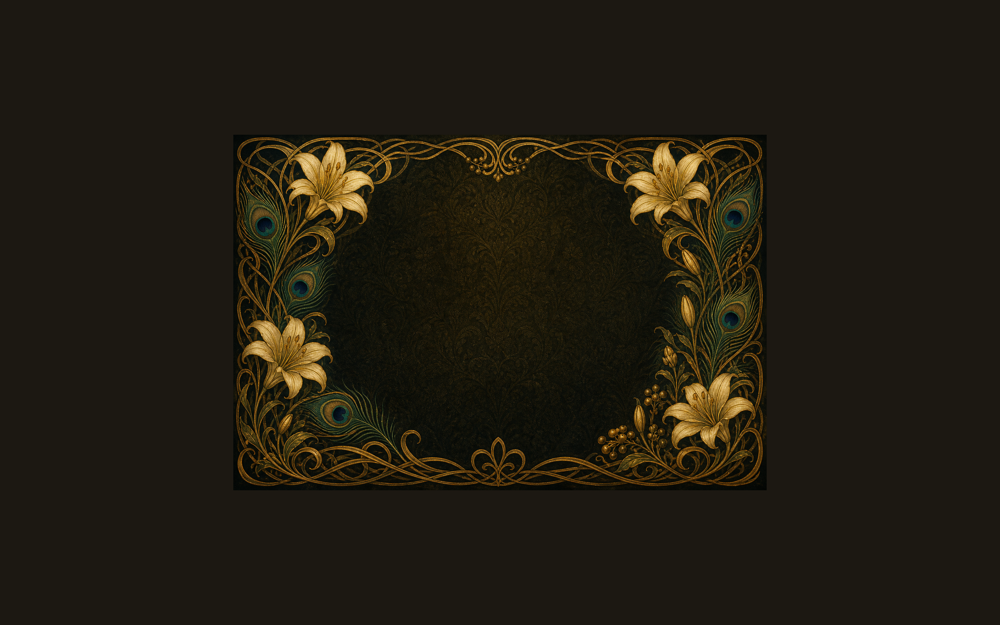

# Jugend

A dark **Jugendstil / Art Nouveau** desktop theme for [Omarchy 4 (Quattro)](https://github.com/basecamp/omarchy). Warm black and olive surfaces with gilded accents; ornament lives on the wallpaper and lock/preview imagery while Hyprland window chrome stays calm.



## Install

```bash
omarchy theme install https://github.com/mauricewipf/omarchy-jugend-theme
```

Then open **Style → Theme** in the Omarchy menu and select **Jugend**.

## Palette

| Role | Color |
|------|-------|
| Accent (gold) | `#c9a84c` |
| Background | `#1c1812` |
| Foreground (ivory) | `#e6d7bf` |
| Selection | `#3a3228` |
| Muted | `#6a5e4e` |

The full palette, including ANSI `color0`–`color15`, lives in [`colors.toml`](colors.toml). Hyprland active borders use a subtle gold-to-teal gradient derived from the accent and blue stops.

## Contents

This repo is the theme directory itself (Omarchy clones it into `~/.config/omarchy/themes/`). It ships:

- `colors.toml` — source of truth for the palette
- `shell.*.toml` — gold lock, bar, menu, and launcher accents
- `keyboard.rgb` — gold keyboard backlight
- `icons.theme` — `Yaru-olive` for warm olive file icons
- `backgrounds/wallpaper.png` — official Jugend wallpaper
- `preview.png` / `preview-unlock.png` — theme switcher previews

Terminal configs, Lua, and `vscode.json` are intentionally omitted so Omarchy generates them from templates at install time.

## License

MIT — see [LICENSE](LICENSE).
